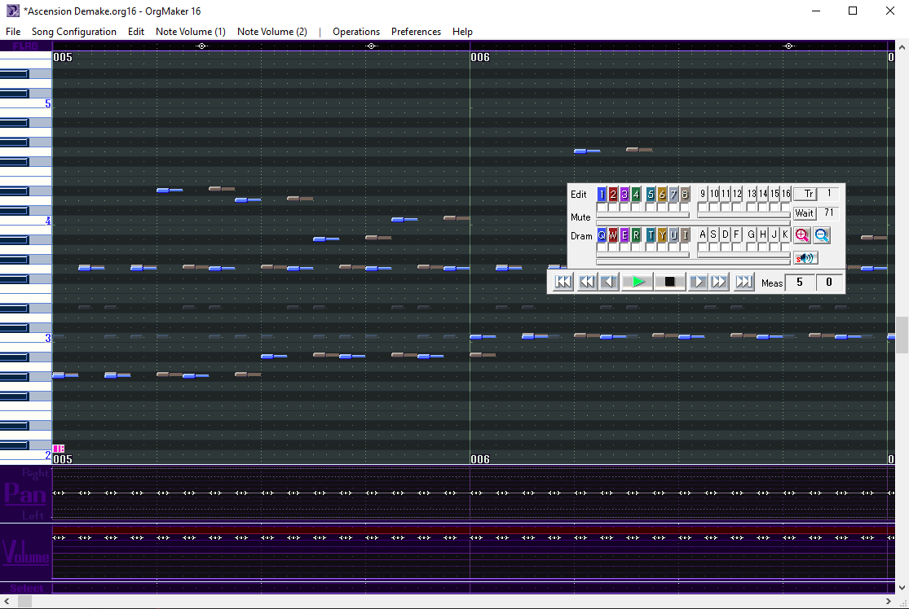

**The latest and greatest in 32 Organya Track technology!**

**Fork of a Fork of a music sequencer for retro video games**

This does not use a MIDI device.  

## History

The original program was created by [Studio Pixel](http://studiopixel.sakura.ne.jp/) in 1999, and was used in [Cave Story](https://www.cavestory.org/) and [Azarashi](https://www.cavestory.org/pixels-works/azarashi.php).

It was then updated multiple times by [Rxo Inverse](https://www5b.biglobe.ne.jp/~kiss-me/aji/index.html) throughout 2003-2014, and was used in [STARGAZER](https://www5b.biglobe.ne.jp/~kiss-me/aji/stargazerj.html)

As of this being written, [Strultz](https://strultz.github.io/) is working on [OrgMaker 3](https://github.com/Strultz/orgmaker-3/tree/main), which aims to add more features to OrgMaker.

## Features

16 Melody Tracks with 100 Waveforms to select from, along with 16 Dram Tracks with 43 Dram Samples to choose from.

Compatable with all ORG files.

Exporting ORG-16 as a WAV file.

(Eventually) A hack to introduce it into Cave Story!

## Download

Check the Releases for the latest version: 

## Compiling

You'll need Visual Studio(it doesn't matter the version) with the `Desktop development with C++` workload. You should also select something along the lines of  `C++ v143 build tools`. After installing, open `source/Org3.sln` and build the project.

## License

BSD 3-Clause License

